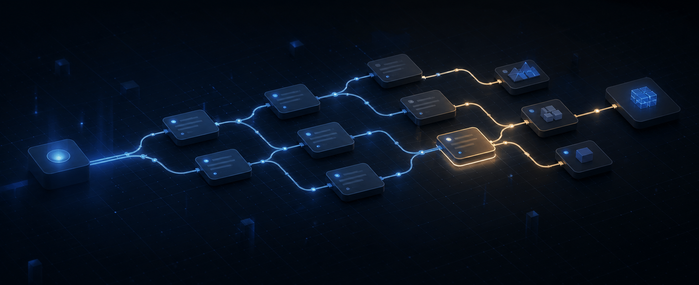
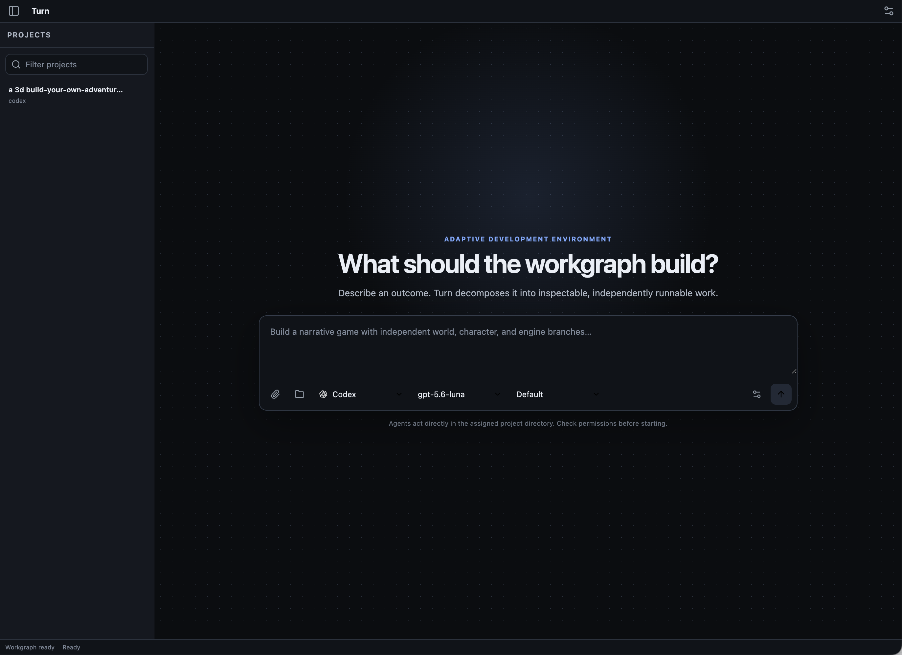
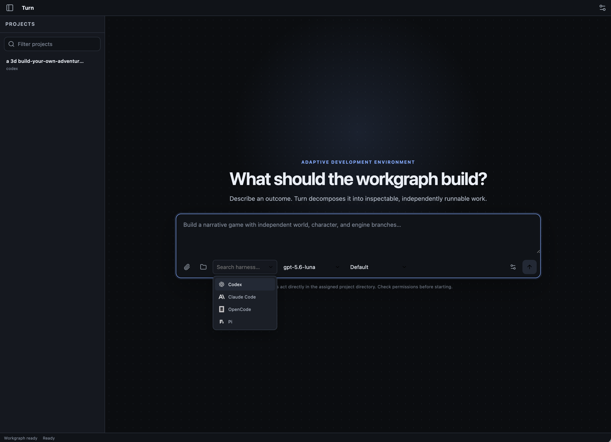
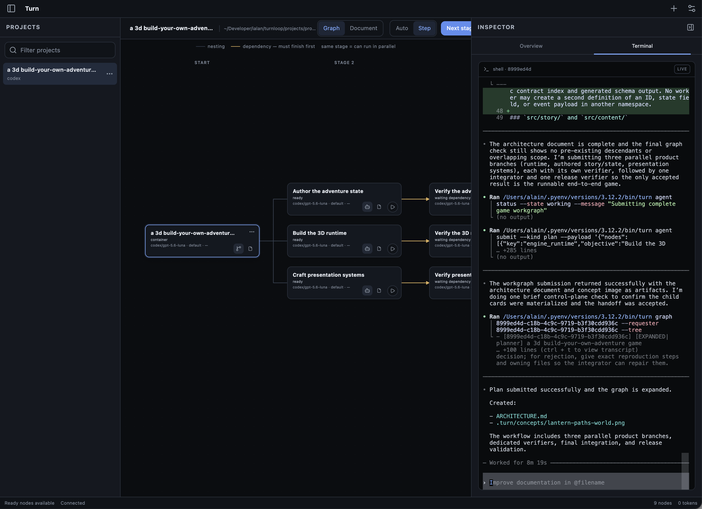
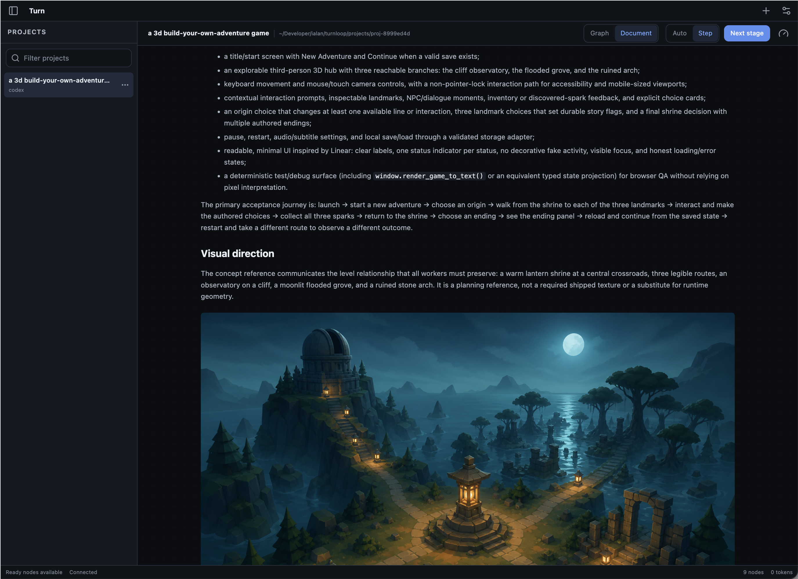
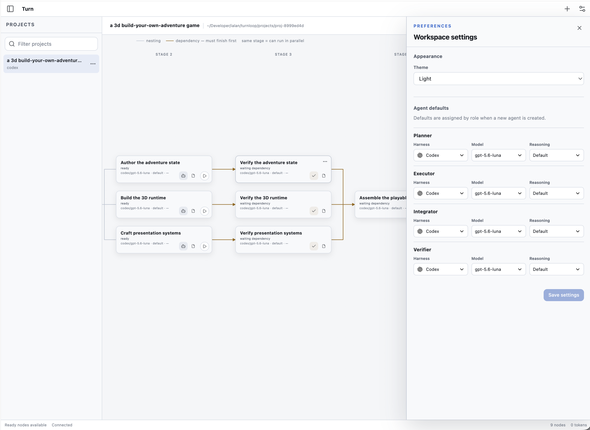

<p align="center">
  
</p>

<h1 align="center">Turn</h1>

<p align="center">
  <strong>Adaptive development, made visible.</strong><br>
  Turn turns an outcome into an inspectable workgraph, then helps you execute it one deliberate step at a time.
</p>

<p align="center">
  <a href="pyproject.toml"></a>
  <a href="turn/server"></a>
  <a href="ui"></a>
  <a href="turn/tests"></a>
  <a href="https://github.com/alainux/turnloop"></a>
</p>

<p align="center">
  <a href="#why-turn">Why Turn</a> ·
  <a href="#product-surface">Product surface</a> ·
  <a href="#screenshots">Screenshots</a> ·
  <a href="#run-locally">Run locally</a> ·
  <a href="#verification">Verification</a>
</p>

## Why Turn

Most agent workflows begin with a prompt and quickly become a stream of opaque
tool calls. Turn keeps the plan, execution, and evidence in one visible control
surface:

- **Start with intent.** Describe the outcome instead of manually inventing a task list.
- **See the decomposition.** Turn renders containment, dependencies, parallel branches, and integration points as a workgraph.
- **Run with control.** Choose step-by-step or auto-run execution, pause between stages, retry failures, and provide human input when needed.
- **Inspect the work.** Open the document view, terminal, logs, artifacts, costs, and durable agent sessions from the same project.
- **Keep ownership local.** Project state lives on disk, while planner and worker adapters keep harness-specific behavior replaceable.

Turn is designed for complex software, games, books, and other outcomes where
the path matters as much as the final artifact.

## Product surface

| Surface | What it gives you |
| --- | --- |
| Project authoring | Prompt-first creation, project explorer, attachments, and working-directory selection |
| Workgraph | A deterministic left-to-right graph with parallel branches and explicit dependencies |
| Execution | Auto/step policies, retries, timeouts, cancellation, recovery, and human-input gates |
| Agent workspace | Durable PTY-backed terminals, reconnectable sessions, and provider-neutral transport |
| Evidence | Document view, logs, artifacts, diffs, token/cost usage, and server-projected UI state |
| Harnesses | Codex, Claude Code, OpenCode, and Pi adapters with local availability detection |

Deterministic Echo workers and heuristic planning are test-only fixtures; they
are not exposed by the served application.

## Screenshots

The screenshots below show the authoring surface, harness selection, graph and
terminal inspection, document view, and workspace preferences.

<table>
  <tr>
    <td></td>
    <td></td>
  </tr>
  <tr>
    <td></td>
    <td></td>
  </tr>
  <tr>
    <td colspan="2"></td>
  </tr>
</table>

## Architecture

The graph is the source of truth. `PlanResult` and `WorkerResult` are strict
domain contracts; the runner owns transitions; the store owns durable local
project files; the UI and CLI are clients.

```text
prompt
  │
  ▼
planner ──▶ PlanResult ──▶ workgraph ──▶ runner ──▶ harness adapter
                                      │              ├─ Codex
                                      │              ├─ Claude Code
                                      │              ├─ OpenCode
                                      │              └─ Pi
                                      ▼
                              logs · artifacts · diffs · usage
```

For broad requests, a plan can carry an executive summary, approach, typed
sections, decisions, risks, acceptance criteria, and optional diagrams. The
document view renders that metadata alongside the dependency graph, and worker
nodes receive the same graph-owned context.

The main boundaries are deliberately small:

- `turn/domain/` — schemas, state transitions, and UI-state projection
- `turn/db/` — local project-file persistence
- `turn/graph/` — pure graph evaluation
- `turn/runner/` — scheduling, recovery, events, and terminal lifecycle
- `turn/workers/` — planner, worker, and harness adapters
- `turn/server/` — REST, SSE, security, and static UI boundary
- `ui/` — strict TypeScript client and interaction state

## Run locally

### Prerequisites

- Python 3.11+
- Node.js and npm
- Herdr for project terminals
- At least one supported coding harness installed locally for real runs

### Install and start

```bash
python -m pip install -e ".[dev]"
npm install
npm run build
herdr                    # start or attach the default Herdr service
./scripts/run.sh         # start Turn at http://127.0.0.1:8000
```

Turn uses the repo-local `projects/` directory by default. Override it when
needed:

```bash
TURN_PROJECTS_DIR=/path/to/projects ./scripts/run.sh
```

Open <http://127.0.0.1:8000>, describe an outcome, choose an installed harness,
and create the workgraph. Step mode is the safe default; execution is always an
explicit product action.

### Headless CLI

```bash
turn doctor
turn create "Build an adaptive narrative engine" --harness codex --run
turn projects
turn graph PROJECT_UUID --tree
turn run PROJECT_UUID
turn serve --port 8000
```

When run from a project directory, `turn create` uses that current directory as
the project directory. The UI/server uses `TURN_PROJECTS_DIR` for its default
project root.

## Verification

```bash
npm run typecheck
npm test
npm run build
python -m pytest -q
```

The test suite covers:

- domain schemas, transitions, graph invariants, and storage
- REST, SSE, security, and project lifecycle behavior
- harness capability detection and adapter contracts
- PTY ANSI/input/resize/stall behavior
- browser authoring, graph inspection, terminal transport, themes, and responsive layouts
- deterministic full-run persistence for software, story, and book-shaped workflows
- installed-Herdr integration, durable panes, and cleanup boundaries

Model-backed demonstrations prove installed-harness integration; they are kept
separate from deterministic quality scores.

## Project layout

```text
turn/core.py                 headless application facade
turn/domain/                 schemas and pure UI-state projection
turn/db/                     local project-file persistence
turn/graph/                  pure graph evaluation
turn/runner/                 scheduling, transitions, recovery, events
turn/workers/                planner and harness adapters
turn/server/                 REST, SSE, and static UI boundary
turn/tests/                  unit, integration, API, and browser tests
ui/                          dependency-free IDE shell and UI reducer
docs/assets/                 product screenshots and social/GitHub banner
```

## Design constraint

The store never guesses planner intent. It validates keys, references, and graph
acyclicity, then preserves valid objectives and topology exactly—without hidden
child caps, semantic deduplication, title truncation, or domain-specific nodes.

The visual and interaction contract lives in [DESIGN.md](DESIGN.md). This README
is the product, architecture, scope, operation, and verification guide.
